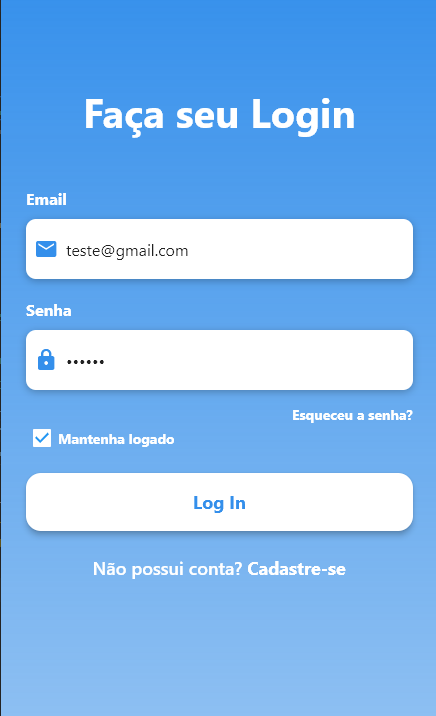

# Login page layout

## Professor 
- Fabricio Bizotto

## Aluno 
- Guilherme P do Amarilho

## Atividades
- Primeiro contato com o flutter

> ### Descrição
> 
>Crie seu primeiro aplicativo com pelo menos: 
>   - 1 tela que implemente o componente Scaffold com Appbar e Body; 
>   - Componentes de texto; 
>   - Componente de botão ou ícone para executar alguma ação; 
>   - Componente de coluna ou linha (Column ou Row); 
>   - Utilizar a função setState para gerenciar o estado da tela de alguma forma; 

### Imagem referência

